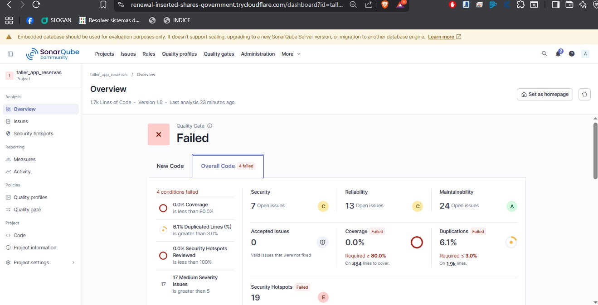
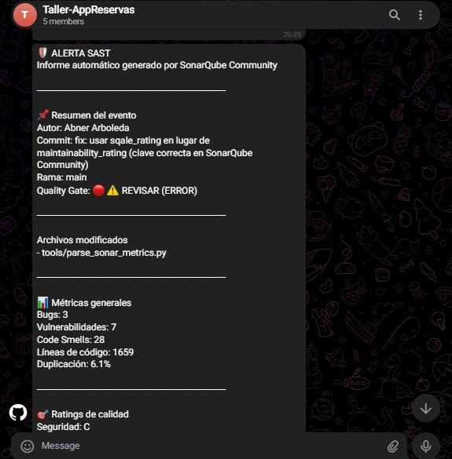
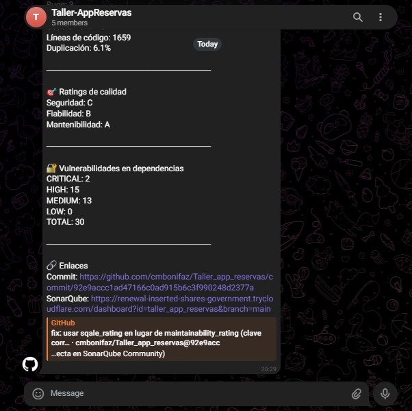

# 📊 Reporte de Evidencias y Configuración de Quality Gates

Este documento detalla la configuración del Quality Gate personalizado (`StrictGate`) implementado en SonarQube para el proyecto **ReservasEC**, así como las evidencias de integración con GitHub Actions y las alertas automáticas en Telegram.

---

## 🛠️ 1. Configuración del Quality Gate (`StrictGate`)

Para garantizar que el código cumpla con los estándares más altos antes de ser integrado, se definió e implementó en SonarQube un Quality Gate restrictivo con las siguientes métricas:

| Métrica | Condición | Umbral | Estado esperado |
| :--- | :--- | :--- | :--- |
| **Blocker Issues** | Mayor que | 0 | Ningún error de tipo bloqueante permitido. |
| **Critical Issues** | Mayor que | 0 | Ningún error crítico permitido. |
| **Major Issues** | Mayor que | 5 | Máximo de 5 errores graves en el código. |
| **Security Hotspots Reviewed** | Menor que | 100% | Todos los puntos de seguridad detectados deben ser revisados. |
| **Coverage** | Menor que | 80% | El código debe tener al menos un 80% de cobertura de pruebas. |
| **Duplicated Lines (%)** | Mayor que | 3% | El porcentaje de código duplicado no debe superar el 3%. |
| **Technical Debt Ratio** | Mayor que | 2.5% | El porcentaje de deuda técnica permitido es de máximo 2.5%. |
| **Cyclomatic Complexity (total)** | Mayor que | 50 | Complejidad ciclomática total máxima de 50. |
| **Cognitive Complexity (total)** | Mayor que | 30 | Complejidad cognitiva total máxima de 30. |

---

## 📸 2. Evidencias del Funcionamiento

### A. Captura de Pantalla de SonarQube (Quality Gate Fallido)
A continuación, se presenta la evidencia del análisis estático de código en SonarQube, el cual falla al detectar errores e incumplir los umbrales definidos en el `StrictGate`.

---

### B. Captura de Pantalla de Notificaciones en Telegram
Evidencia de la recepción automática e inmediata en el grupo de Telegram del reporte completo de métricas tras cada commit/push en el repositorio de GitHub.

#### Parte 1: Resumen del Evento y Archivos Modificados

#### Parte 2: Métricas de SonarQube y Vulnerabilidades de Dependencias

---

## 🚀 3. Flujo del Pipeline (CI/CD)

El pipeline configurado en GitHub Actions realiza las siguientes tareas de forma automatizada ante eventos de `push` o `pull_request` hacia la rama principal:

1. **Checkout del Código**: Obtiene el código fuente completo del repositorio.
2. **Setup de Entorno**: Configura el entorno necesario para compilar y probar.
3. **Análisis de SonarQube**: Ejecuta el escaneo de código enviando los reportes al servidor local de SonarQube.
4. **Verificación de Quality Gate**: Valida el estado del Quality Gate y determina si el flujo pasa o falla.
5. **Auditoría de Dependencias**: Ejecuta de manera concurrente/secuencial `npm audit` para contabilizar vulnerabilidades en librerías externas.
6. **Notificación a Telegram**: Envía el reporte formateado al grupo de Telegram detallando el autor, commit, rama, estado del Quality Gate, métricas de SonarQube y vulnerabilidades de dependencias.
